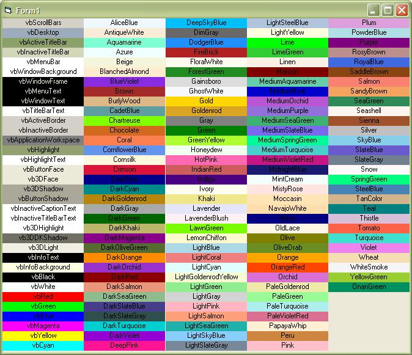



## Change/ Add To VB's ColorConstants

### Description

Most people know about and use VB's color constants. Most people that I know think green and yellow are a little too bright. Did you know that you can override and change the colors to what you want them to be? Using this technique you can also add your own predfined colors. I have added all of the constants defined in LaVolpe's color picker to show you just some of the possibilities.
 
### More Info
 

             |
---                |---
**Submitted On**   |2004-11-23 16:25:02
**By**             |[james kahl](https://github.com/Planet-Source-Code/PSCIndex/blob/master/ByAuthor/james-kahl.md)
**Level**          |Beginner
**User Rating**    |4.6 (32 globes from 7 users)
**Compatibility**  |VB 5\.0, VB 6\.0
**Category**       |[Graphics](https://github.com/Planet-Source-Code/PSCIndex/blob/master/ByCategory/graphics__1-46.md)
**World**          |[Visual Basic](https://github.com/Planet-Source-Code/PSCIndex/blob/master/ByWorld/visual-basic.md)
**Archive File**   |[Change\_\_Ad18212211232004\.zip](https://github.com/Planet-Source-Code/james-kahl-change-add-to-vb-s-colorconstants__1-57390/archive/master.zip)

